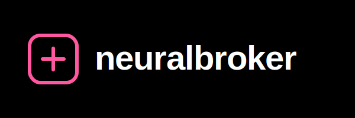

# NeuralBroker 2.0 — Swarm-Native Orchestration Platform



### VRAM-aware LLM routing · Zero-Trust Federation · MCP Server · Agentic Swarms


[](https://pypi.org/project/neuralbrok/)


[](https://neuralbroker.space)

---

## The Ultimate Agent Orchestration Platform

NeuralBroker 2.0 transforms your machine into a **Swarm-Native Orchestration Node**. It goes far beyond standard model routing. It automatically evaluates your hardware, runs localized HNSW-vector memory, coordinates multi-agent task pipelines, and securely talks to other machines across the internet via Zero-Trust Federation.

```bash
pip install neuralbrok
neuralbrok start
```

That's it. Point **Claude Code**, **Cursor**, or any OpenAI-compatible app at `localhost:8000/v1` (or connect via the built-in MCP server), and the Swarm takes over.

---

## 🌟 What's New in v2.0

### 1. Agentic Swarms & Task Coordination
NeuralBroker doesn't just route prompts; it routes *objectives*. The built-in `SwarmCoordinator` decomposes complex user requests into **Plan → Execute → Review** pipelines, automatically picking the best specialized local agent (Coder, Planner, Reviewer, Analyst) for each subtask.

### 2. NeuralFit Hardware Intelligence
Powered by a native Python implementation of our advanced hardware scoring algorithm, NeuralBroker scores models across **Quality**, **Speed**, **Fit**, and **Context** based on your exact hardware specifications (NVIDIA, Apple Silicon, AMD, or CPU).
*Run `neuralbrok fit` to see your live VRAM projections and tok/s estimates.*

### 3. AgentDB (Vector Memory) & ReasoningBank
NeuralBroker now features a zero-dependency **HNSW-style Vector Store** built on NumPy. When your Swarms succeed at a complex task, the execution trajectory is saved into the `ReasoningBank`. Future agents automatically inject this historical context to solve similar problems faster.

### 4. Zero-Trust Federation (Agent-to-Agent Comms)
Swarms can now securely communicate across networks. Using our local **mTLS/Ed25519-style** crypto module, your agents can encrypt and sign payloads and send them to other NeuralBroker nodes. Untrusted nodes are automatically downgraded. 
*Run `neuralbrok federation init` to start.*

### 5. Security & AIDefence
Every prompt is now scrubbed. 
- **PII Redaction:** AWS keys, emails, and SSNs are automatically masked before reaching cloud LLMs.
- **Injection Shield:** Federated incoming requests are heuristically scanned for adversarial jailbreaks ("ignore previous instructions").

### 6. Background Workers (Autopilot)
When your machine is idle, NeuralBroker wakes up. The internal `WorkerDaemon` launches background tasks to optimize codebases and run simulated security audits while you sleep.

### 7. MCP Server & Dynamic Plugins
NeuralBroker is now a native **Model Context Protocol (MCP)** server via stdio. Connect Claude Code directly to it. Want more agents? You can dynamically load `.yaml` agent definitions into your `~/.neuralbrok/plugins/` directory and share them with the community.
*Run `neuralbrok plugins list` to view.*

---

## 🚀 Subscription Inheritance

You already pay for Claude Pro. NeuralBroker lets **every app on your machine** use it — automatically, for free. It reads the OAuth session your Claude Code CLI holds in `~/.claude/.credentials.json` and uses the `claude` binary as a free inference backend for hard tasks that spill over from your local GPU.

```python
from openai import OpenAI
client = OpenAI(base_url="http://localhost:8000/v1", api_key="any-string")
response = client.chat.completions.create(
    model="claude-sonnet-4-6",
    messages=[{"role": "user", "content": "Hello"}]
)
# Routed through your Claude Pro subscription. Cost: $0.
```

---

## 💻 Quickstart

### 1. Install & Start
```bash
pip install neuralbrok
neuralbrok start
```

### 2. Check Hardware Fit
```bash
neuralbrok fit
```

### 3. Start the MCP Server (For Claude Code/Cursor)
```bash
neuralbrok mcp
```

### 4. View Dashboard
Open `http://localhost:8000/dashboard` to view the live **Pink Matrix** telemetry UI, complete with routing waterfalls and VRAM gauges.

---

## 🔌 API & Integrations

### NeuralBroker serves standard endpoints:
- `POST /v1/chat/completions` (OpenAI format)
- `POST /nb/federation/receive` (Zero-Trust node comms)
- `GET /nb/hardware` (Telemetry)

### Auto-Configured Integrations:
Run `neuralbrok integrations setup <ide_name>` to automatically connect:
- Claude Code
- Cursor
- GitHub Copilot
- Cline
- ...and 15+ more.

---

## 🛠️ Development

```bash
git clone https://github.com/khan-sha/neuralbroker.git
cd neuralbroker
python3 -m venv .venv && source .venv/bin/activate
pip install -e .
pytest tests/
```

MIT License — see `LICENSE`.
